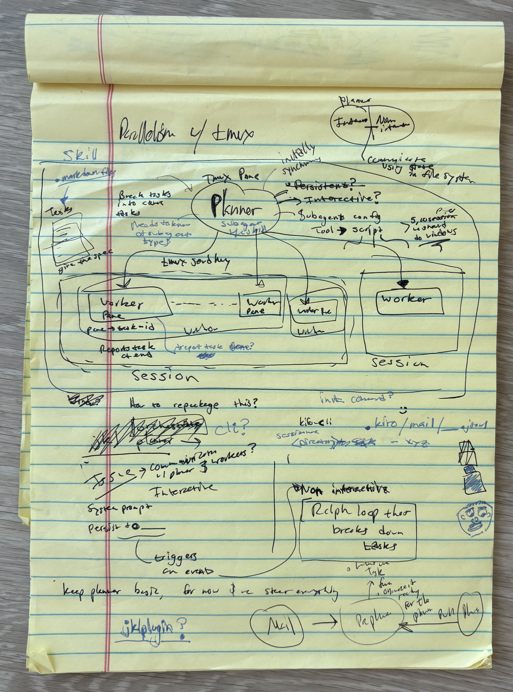

Scrolling X and I saw this demo of Claude Code Agent teams:

<blockquote class="twitter-tweet" data-theme="dark">
opus 4.6 with new “swarm” mode vs. opus 4.6 without it.  2.5x faster + done better.  swarms work!  and multi-agent tmux view is *genius*.  insane claude code update. <a href="https://t.co/YjGgBoYatb">pic.twitter.com/YjGgBoYatb</a>
&mdash; Mckay Wrigley (@mckaywrigley) <a href="https://twitter.com/mckaywrigley/status/2019557279222439962?ref_src=twsrc%5Etfw">February 5, 2026</a></blockquote> 

As a power user of my terminal and terminal agents, this new Claude Code feature looked very intriguing. Mostly because
I am sort of already doing this myself using tmux. I usually spawn N number of panes for each agent to work in. Having the agent
be the delegate (or leader) of this orchestration looked like something that I could throw into my tool chest.

At Amazon we are not allowed to use Claude Code, instead we use [Kiro Cli](https://kiro.dev/cli/), so for obvious reasons I don't
have access to this feature and something similar in Kiro Cli does not exist yet. I didn't want this to stop me. And I felt pretty inspired by Cursor's recent blog
posts regarding their work on long running agents.

<blockquote class="twitter-tweet" data-theme="dark">
Long-running agents are now available at <a href="https://t.co/3PT8c7azU3">https://t.co/3PT8c7azU3</a> for Ultra, Teams, and Enterprise plans.  With our new harness, agents can complete much larger tasks.<a href="https://t.co/7p57WeR04t">https://t.co/7p57WeR04t</a> <a href="https://t.co/pGePEFRPTT">pic.twitter.com/pGePEFRPTT</a>
&mdash; Cursor (@cursor_ai) <a href="https://twitter.com/cursor_ai/status/2022046178708492445?ref_src=twsrc%5Etfw">February 12, 2026</a></blockquote> 

I whipped out the handy dandy notepad and brainstormed my own long running agent "orchestration", heavily inspired by Cursor's long running agent harness and some things
I've been reading here and there on X. Here is what my brain dump looked like:

The "harness", we will loosely use the word here, is comprised of:

- planner (team lead)
    - The planner is interactive. Breaks tasks into atomic tasks and reads the mail from `.kiro/mail/<file>.<txt/json/md>`
    - This ended up being its own window.
- workers
    - These are workers that are started by the planner to drive atomic tasks to completion. They are [headless](https://kiro.dev/docs/cli/reference/cli-commands/#kiro-cli-chat?no-interactive) Kiro Cli instances spawned by the planner
    creating a new pane and using send-keys.
    - Panes in windows.
- mail
    - Ideas and epochs placed here. Mail could also be some details of a task being worked on or some general steering. For the initial run,
    this was mostly the staging ground for things that would be broken down into tasks.
- tasks
    - These are what the workers would drive to completion. In the system prompt of the planner, I specified a json format of the tasks.
- specs
    - The workers typically need more than just a task. The specs were mapped to a task and the worker would refer to the task and spec

## How I formalized this into a functional thing?

Kiro Cli uses [agent configs](https://kiro.dev/docs/cli/custom-agents/configuration-reference/) as the core primitive and its basically a json file where you can
customize an agent by giving it tools, prompts, MCP servers, and skills. To start with I figured using an SDK like Strands or Claude SDK would be overkill and maybe take too much effort.
I realized that my POC, or something could be useable at first, was going to be using a custom Kiro agent config with a skill and a good system prompt. I also quickly realized
that I should be in the loop for now by creating a planner agent config that I could steer to break down tasks and manage it. Reaching for autonomous orchestration seemed like a ripe playground
for hallucinations. Plus, I could prompt the agent to do a lot of work and not require my input (and this is what I ended up doing).

These entities I laid out in the harness are agent configurations with a system prompt tailored for its purpose. The planner agent, the only interactive agent, was given a skill. This skill
was some basic tmux commands like spawning panes for each worker agent and then having the constraints like if we have too many workers in a window, create a new window and spawn more panes there.
This is how I achieved agents working in parallel. I did not use the kiro cli subagent tool, as I find it to be pretty early on in its implementation. Having workers in panes is simpler and gives me more control.

#### Some notes about the planner system prompt:

I had instructions where the planner agent needed to have a learnings file (`.kiro/planner-learnings.md`) and then every so often it would need to remember to add learnings here.
When I noticed that it would do things wrong in the interactive planner thread, I would say add this to learnings and it would think about what it just did, what it did right, what it did wrong
and it surprisingly added some decent learnings. At one point without any guidance it changed its agent configuration file by adding a hook to prevent it from running a command that could kill its own tmux pane.
Having this in a file makes it easy to evaluate and make change changes in the future system prompt and/or agent configurations. It persists
these learnings and is not lost when I close the planner agent (my main thread).

# Learnings from this process

####  Don't reach for autonomous right away

Creating an autonomous system that can run for long periods of times takes a lot of effort and thoughtful architecture decisions because agents can go off course very easily.
Understanding how to control many agents is a difficult task alone, so I think it is better to approach this one first. Crawl before you can run.

#### Missing a mechanism for the parallel agents to communicate to the planner agent

What the planner thread ended up doing was have the workers use `send-keys` and report their task completion status once the worker instance ended.
The planner agent was smart enough to clean up all the panes
and think about the next set of tasks to break down and spawn. This sort of worked, but when I had a lot of agents running in parallel and finishing at different times and more failures, this process started failing
and I had to increasingly become more in the loop.
This was the piece of the orchestration that was probably the most rough around the edges. It worked most of the time.
But as I started scaling the agents to many working in parallel, say about 12+, a lot of issues started occurring.

#### Context window gets burned through

Using the Opus 4.6 model with the normal context window size, after breaking down tasks, managing workers that completed their tasks, failed to complete their tasks because they either failed or their process randomly died,
and thinking about converting the mail to tasks that were small enough to complete, the context window was regularly reaching full capacity. I ended up switching to the 1 million sized context window
and this improved the orchestration, but I could sense that the context rot was still an issue because the planner agent didn't feel as smart and  Kiro Cli seemed to also not manage this context as well since the context percentage indicator
always seemed off.

#### Many agents running in parallel becomes a distributed systems problem

In the system there were a lot of points of failure, entities that needed some level of orchestration and communication, this distributed systems problem reared its head.
Doing this naively by having agents control everything and be the judge was brittle.
This is where a more thoughtful harness is needed. Although, the Opus model is quite smart and can get you pretty far.

#### Agents Self Learning

When prompted, agents are suprisingly reflective and know what they could do the next time to improve their output. And then when you're in the loop as a human, you can also evaluate what it did and what it thinks it could learn from or what it could do better next time.
This combination seems pretty effective at improving the agent configs and steering for the next runs.

