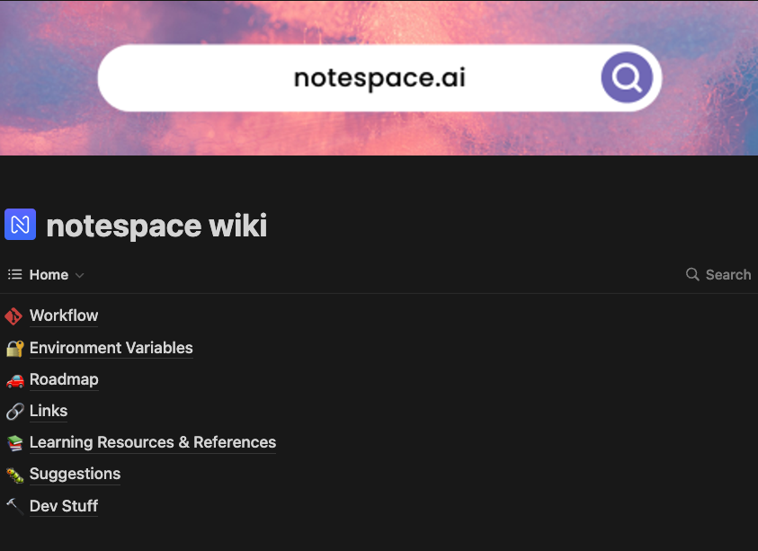
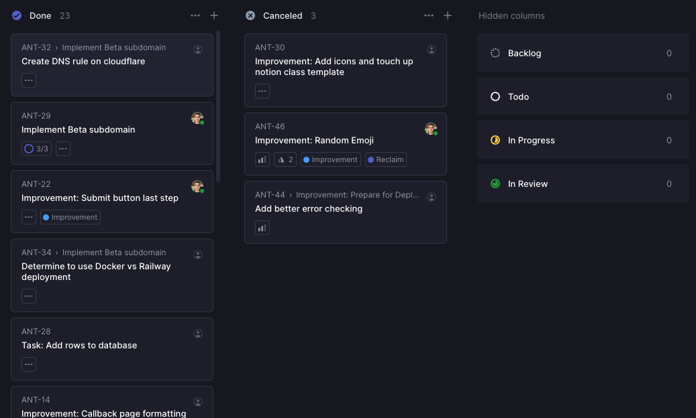
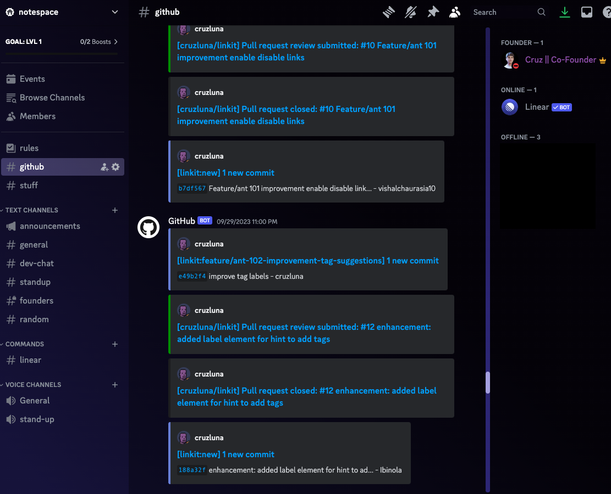

# tldr

Set up a notion workspace, Linear, and discord server for a small remote group.

## Background

I was working on project, essentially a Link Tree clone, and I decided that if I wanted the project to scale I should onboard some
other people to build out some of the features while I tackle some of other challenging tasks. Looking back at it, I learned some lessons
like if you want to build a start up, to just do it yourself or with a cofounder and do it all. Don't get others until there is a POC with actual users.
Either way, the scope of this post is to quickly describe how I set up an environment that promotes productivity and that is modern.
We can call this the tech stack for creating a work group of developers. By no means is it complete, but its a good start.

## Notion

This is where the team wiki lives. Everything the team might ask, it should be in the wiki.
The basic structure is to have:

- Workflow

  -- Provided the recommended git workflow and how to use it with Linear. (Can't recommend this enough)

- Env Variables

  -- Not the best way of doing stuff, but quick enough. I'll look into doing this with secrets in [github](https://docs.github.com/en/actions/learn-github-actions/variables).

- Roadmap

-- Gives the team of what direction we are headed.

- Links

-- I just threw in the Github repo and Linear link in here.

- Learning Resources

  -- Made a table for helpful links for the different frameworks using in the project.

- Suggestions

  -- This one is kind've unnecessary because suggestions can be added in Discord.

- Dev Stuff

  -- Open ended. I just added some helpful terminal commands. (ie `npx prisma studio`)

## Linear

Linear has been a great tool to handle tasks and to plan out projects. I haven't been able to really dive deep in project roadmaping but
the structure and automation Linear offers for tickets is superb.

Set this area to have the basic columns like backlog, todo, in-progress, in-review, and done.

The thing that was great was setting up the Github integration with Linear that enabled us to have [PR automation](https://linear.app/docs/github#pr-automation).
This way feature branches were automatically created for each task, and the tickets' status would update if a pull request was made and then merged. This made managing tickets so easy
and it reduced the thinking process of working with git. Essentially, it created the feature branches with a name based on the task title, and then once the pull request
was made it was easy to just merge into the trunk.

## Discord

Here is where the direct communication occured. One rule of thumb was to avoid DM's. If people have questions, I want them in the open just in
case others have a similar question and can be used as reference.

In the Discord, I integrated [Github](https://gist.github.com/jagrosh/5b1761213e33fc5b54ec7f6379034a22) and [Linear](https://linear.app/docs/discord) with webhooks.
To be honest, the Linear discord webhook was not very useful, but the team did find the Github one to be informative.

## Conclusion

The basic tech group stack is notion, Linear, Discord, & Github. I think with these building blocks, a group of people can effectively communicate
and be productive.

An honorable mention, Vercel's Github [integration](https://vercel.com/docs/deployments/git/vercel-for-github), preview deployments were great for PR reviews.

If you have any recommendations or suggestions, feel free to message me on [LinkedIn](https://www.linkedin.com/in/cruzluna/).
